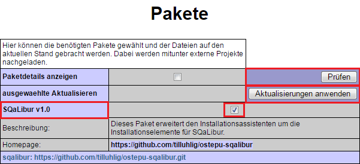
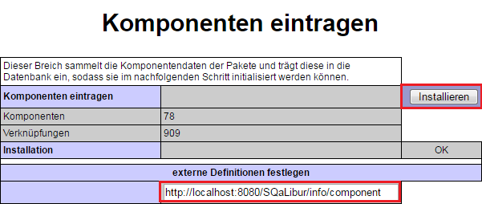
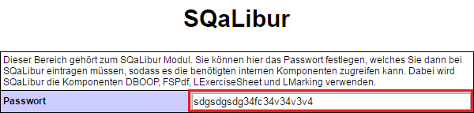
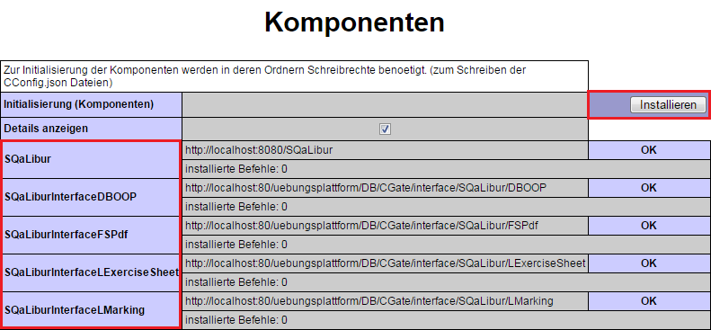
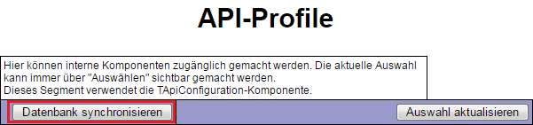

# SQaLibur - Erweiterung des Installationsassistenten von OSTEPU

Die Installation von SQaLibur erfolgt über die Einbindung in den Installationsassistenten von OSTEPU. Dabei muss das Servlet von SQaLibur bereits von der Projektseite heruntergeladen und eingerichtet sein, sodass wir SQaLibur bereits als Webservice ansprechen können.

> A: Paket installieren

Für die Anbindung an OSTEPU wird zunächst das Paket von SQaLibur in der Paketauswahl selektiert (Abbildung A) und damit die Erweiterung des Installationsassistenten vorgenommen. Nun enthält dieser neue Bereiche wie den in \abb{sqaliburKonfiguration} und eine Erweiterung der Komponenteninstallation in Abbildung B.

> B: SQaLibur als Komponente installieren

In Abbildung B muss nun der Befehl eingetragen werden, unter dem die Definitionsdatei von SQaLibur erreichbar ist. Diese sollte normalerweise beim Webservice von SQaLibur hinter dem Befehl ``GET /component`` verfügbar sein.

> C: SQaLibur konfigurieren

Damit SQaLibur auf die Komponenten von OSTEPU zugreifen kann, muss der Zugang konfiguriert werden. Dabei wird SQaLibur mittels einer HTTP-Authentifizierung der Zugang ermöglicht. Das Passwort muss dazu wie in Abbildung C festgelegt werden und anschließend manuell in der data/AuthConfig.json von SQaLibur hinterlegt werden.

> D: SQaLibur mit OSTEPU verbinden

Die neue Komponente SQaLibur kann nun mit dem restlichen System verbunden werden, indem entsprechend Abbildung D die Verbindungen von SQaLibur zu OSTEPU und umgekehrt initialisiert werden. Zusätzlich richten wir darüber die externen Zugänge für SQaLibur ein, diese beziehen sich auf das neue CGate.

> E: die Zugänge für SQaLibur installieren

Damit CGate später auch unsere Anfragen korrekt weiterleiten kann, werden die Zugangsdefinitionen von SQaLibur noch mit der Datenbank von OSTEPU synchronisiert. Damit kann SQaLibur nun auch HTTP authentifizierte Anfragen an OSTEPU stellen.
